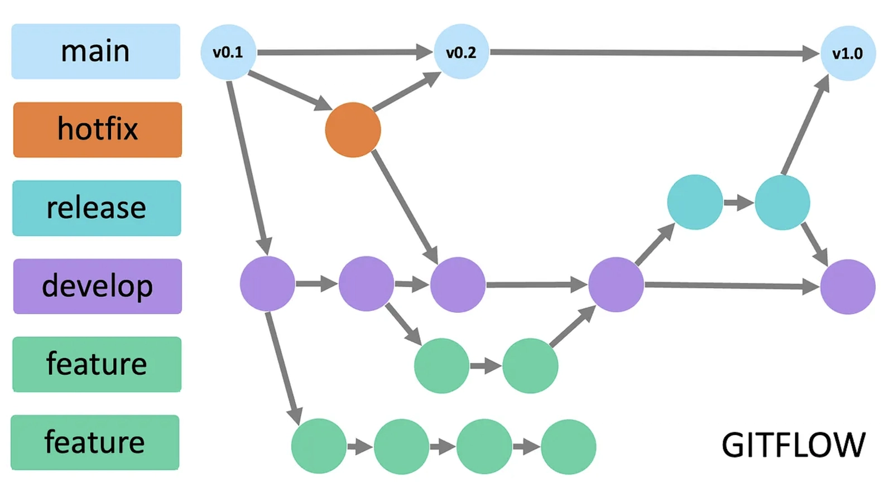

# Git flow

<figure><figcaption></figcaption></figure>

1. Start branch -> <mark style="color:blue;">get master (hotfix)</mark> -> has <mark style="color:orange;">my branch (feature name)</mark>
2. Complete feature -> You want test -> You need create branch from <mark style="color:purple;">develop</mark>  -> <mark style="color:green;">my branch dev</mark> -> merge/rebase/cherrypick <mark style="color:orange;">my branch</mark> <mark style="color:$primary;">-> fix conflict -> create pull request from</mark> <mark style="color:green;">my branch dev</mark> <mark style="color:$primary;">to</mark> <mark style="color:purple;">develop</mark>
3. commit attachment id issue (#number\_id #number\_id)

<figure><figcaption></figcaption></figure>

<figure><figcaption></figcaption></figure>
