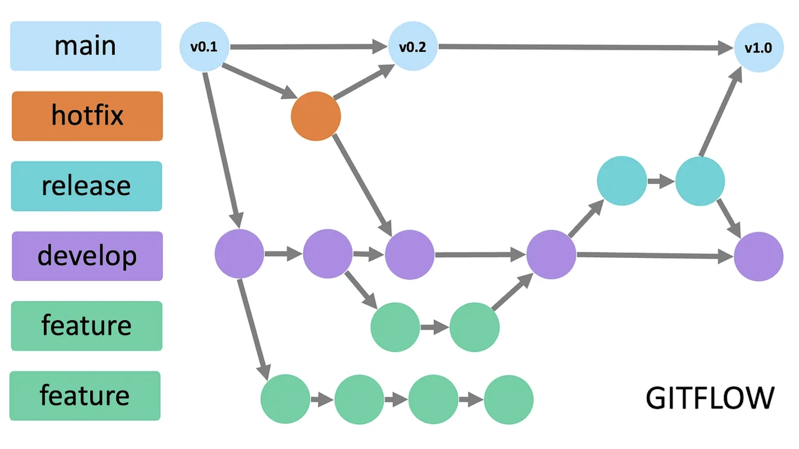

# Quy trình Git

Team dùng một biến thể nhẹ của Git Flow: ba branch dài hạn và các branch feature ngắn hạn.

<figure><figcaption>Tổng quan quy trình Git</figcaption></figure>

## Branch dài hạn

| Branch | Vai trò |
| --- | --- |
| `master` | Production. Chỉ nhận hotfix và merge release. |
| `develop` | Branch tích hợp cho release sắp tới. Mọi QA test trên branch này. |
| `feature/*`, `hotfix/*` | Branch ngắn hạn, mỗi kỹ sư sở hữu một branch. |

## Quy trình hằng ngày

1. **Bắt đầu một feature**
   - Tạo branch từ `master` nếu là hotfix, hoặc từ bản mới nhất của `develop` nếu là feature mới.
   - Đặt tên branch theo nội dung công việc, ví dụ `feature/product-search`, `hotfix/checkout-redirect`.

2. **Phát triển và test**
   - Commit nhỏ, gọn, tập trung trên branch feature của bạn.
   - Khi feature sẵn sàng cho QA, tạo branch tích hợp cá nhân (ví dụ `feature/product-search-dev`) từ `develop`.
   - Merge / rebase / cherry-pick branch feature của bạn vào branch tích hợp đó và xử lý conflict tại đây — đừng bao giờ giải quyết conflict trực tiếp trên `develop`.

3. **Mở Pull Request**
   - Mở PR từ branch tích hợp của bạn vào `develop`.
   - Link issue liên quan trong mô tả PR và tham chiếu issue ID trong commit message dạng `#<issue_id>` (ví dụ `feat(builder): add product search #1234`).

<figure><figcaption>Ví dụ Pull Request 1</figcaption></figure>

<figure><figcaption>Ví dụ Pull Request 2</figcaption></figure>

## Quy ước commit message

- Dùng động từ mệnh lệnh: "Add", "Fix", "Refactor" — không phải "Added" hay "Fixes".
- Khi cần thì thêm scope vào đầu: `feat(api):`, `fix(builder):`, `chore(deps):`.
- Luôn tham chiếu issue ID ở cuối tiêu đề hoặc trong body: `#1234`.
- Giữ tiêu đề dưới 72 ký tự; mô tả chi tiết để trong phần body.

## Checklist trước khi merge

- Branch đã rebase trên `develop` mới nhất (hoặc `master` nếu là hotfix).
- CI xanh.
- Có ít nhất một reviewer approve.
- Mọi issue đã được link và sẵn sàng đóng.
